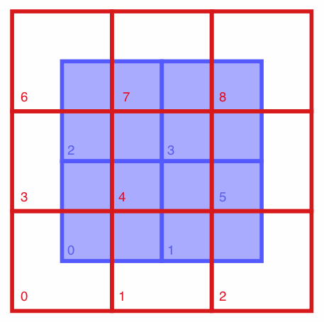

Pandarus
========

Pandarus is software for taking two geospatial data sets (either raster or vector), and calculating their combined intersected areas. Here is an example of two input maps, one in blue, the other in red:

Pandarus would calculate the intersected areas of each spatial unit of both maps, and output the following:

.. code-block:: python

    {(0, 0): 0.25,
     (0, 1): 0.25,
     (0, 3): 0.25,
     (0, 4): 0.25,
     (1, 1): 0.25,
     (1, 2): 0.25,
     (1, 4): 0.25,
     (1, 5): 0.25,
     (2, 3): 0.25,
     (2, 4): 0.25,
     (2, 6): 0.25,
     (2, 7): 0.25,
     (3, 4): 0.25,
     (3, 5): 0.25,
     (3, 7): 0.25,
     (3, 8): 0.25}

The intersected areas are given in square meters. Because Pandarus was designed for global data sets, the `Mollweide projection <http://en.wikipedia.org/wiki/Mollweide_projection>`_ is used as the default projection for calculating areas. Although no projection is perfect, the Mollweide has been found to be a reasonable compromise (e.g. [1]_)

.. warning:: Pandarus is still in development, and given how people misuse and even abuse geospatial data, it will certainly fail for some maps and use cases. Please feel free to file `bug reports <https://bitbucket.org/cmutel/pandarus/issues/new>`_ if things don't work as you expect.

.. [1] Usery, E.L., and Seong, J.C., (2000) `A comparison of equal-area map projections for regional and global raster data <http://cegis.usgs.gov/projection/pdf/nmdrs.usery.prn.pdf>`_

Referencing spatial features
----------------------------

There is no standard way to reference vector features or raster cells. Internally, Pandarus iterates over vector features in the file order, and assigns each an integer id starting from zero. For rasters, a similar procedure is followed, again with an incrementing integer id, iterating over cells starting from the bottom left of the raster, and iterating over rows and then columns.

For vector data sets, the label of a data column which uniquely identifies each feature can be given, and Pandarus will translate the integer id to that data column value. Raster data sets will have their integer ids automatically translated to the label ``"Cell(x, y)``, where ``x`` and ``y`` are the longitude and latitude of the raster cell centroid.

Why Pandarus?
-------------

The software matches two different maps against each other, and `Pandarus was a bit of a matchmaker himself <http://en.wikipedia.org/wiki/Pandarus>`_. Plus, ancient names are 200% more science-y.

Usage
=====

Pandarus installs a command line programs, ``pandarus``. It is called in the command shell or terminal:

.. code-block:: bash

    pandarus <map1> [--field1=<field1>] <map2> [--field2=<field2>] <output> [csv|json|pickle]

After the program name, you need to give the locations of the two spatial data sets, as well as the name of the file to create for the output:

    * ``<map1>`` is the filepath of the first raster or vector spatial data set
    * ``<map2>`` is the filepath of the second raster or vector spatial data set
    * ``<output>`` is the filepath of the outputted file
    * ``<field1>`` and ``<field2>``, if specified, are the names of the columns used to uniquely identify each feature in ``<map1>`` and/or ``<map2>``. For rasters, this value is ignored.
    * ``csv`` or ``json`` or ``pickle``, if specified, is the output format. ``json`` is the default value.

For example, if I was matching the raster ``/Users/cmutel/test.raster`` against the shapefile ``/Users/cmutel/test.shp``, which had a unique data column ``name``, and wanted to create the file ``/Users/cmutel/foo.bar``, using the ``csv`` format, I would enter:

.. code-block:: bash

    pandarus /Users/cmutel/test.raster /Users/cmutel/test.shp --field2=name /Users/cmutel/foo.bar csv

From Python
-----------

Pandarus can also be used as a Python library. See the :ref:`controller` technical documentation.

Output formats
==============

The basic output is, for each intersecting spatial unit in the first and second map, a unique ID for each spatial unit and the intersected area, e.g. ``('Switzerland', 'Rhine watershed', 42)``. The are three ways of reformatting the data when written to a file.

JSON
----

`JSON <http://en.wikipedia.org/wiki/JSON>`_ is a data format originally developed for Javascript but now used widely in many programming languages. This is the recommended and default output format for Pandarus. The JSON output format is:

.. code-block:: javascript

    [
        [map1 id, map2 id, intersected area],
    ]

CSV
---

Pandarus can also export to CSV files. It includes a copy of `unicodecsv <https://pypi.python.org/pypi/unicodecsv/>`_, so that map ids aren't limited to the ASCII character set. CSV files are UTF-8 encoded, and have the following format:

.. code-block:: none

    map1 id, map2 id, intersected area

Pickle
------

Pandarus results can also be serialized into Python `pickles <http://docs.python.org/2/library/pickle.html>`_ with the following format:

.. code-block:: javascript

    [
        (map1 id, map2 id): intersected area
    ]

Technical Details
=================

Computational efficiency
------------------------

Pandarus is relatively computationally efficient. It uses `R tree <http://en.wikipedia.org/wiki/R-tree>`_ indices to screen out geometries where no intersections are possible, and uses Python `multiprocessing <http://docs.python.org/2/library/multiprocessing.html>`_ to split work across all available CPUs. Given its use case in regionalized LCA, further optimizations didn't seem worthwhile.

Wrapping vector and raster data in a common interface
-----------------------------------------------------

The :ref:`map` object provides a common API for both vector and raster data sources. Vector data is loaded using `Fiona <http://toblerity.org/fiona/index.html>`_, and raster data is loaded using the much less pleasant `GDAL <http://www.gdal.org/>`_ library. See the :ref:`map` and :ref:`raster` technical documentation.

.. note:: The common API is not perfect. For example, GDAL raster geometries are given as `WKT <http://en.wikipedia.org/wiki/Well-known_text>`_ strings, but Fiona vector geometries are given as `GeoJSON <http://en.wikipedia.org/wiki/GeoJSON>`_ dictionaries (see ``pandarus.maps.to_shape``).

Projection
----------

Projection between coordinate reference systems is done using a wrapper adapted from code by Sean Gillies based on `pyproj <https://code.google.com/p/pyproj/>`_. See the :ref:`projection` function.

Installation
============

Pandarus can be installed directly from `PyPi <https://pypi.python.org/pypi>`_ using `pip` or `easy_install`, e.g.

.. code-block:: bash

    pip install pandarus

Pandarus source code is on `bitbucket <https://bitbucket.org/cmutel/pandarus>`_.

Requirements
------------

    * `docopt <http://docopt.org/>`_
    * `fiona <http://toblerity.org/fiona/index.html>`_
    * `GDAL <https://pypi.python.org/pypi/GDAL/>`_
    * `progressbar <https://pypi.python.org/pypi/progressbar/2.2>`_
    * `pyproj <https://code.google.com/p/pyproj/>`_
    * `Rtree <http://toblerity.org/rtree/>`_
    * `shapely <https://pypi.python.org/pypi/Shapely>`_

Easier installation using Canopy
--------------------------------

`Enthought Canopy <https://www.enthought.com/products/canopy/>`_ is an easy way to install the geospatial dependencies, which can be a pain, especially on Windows.

Note that `Rtree` will still have to be manually installed, even when using Canopy. See the `rtree docs <http://toblerity.org/rtree/install.html>`_.

Running tests
-------------

.. warning:: The current level of testing is, shall we say, inadequate. You have been warned.

To run the tests, install `nose <https://nose.readthedocs.io/en/latest/>`_, and run ``nosetests``.

Technical reference
-------------------

.. toctree::
   :maxdepth: 2

   map
   raster
   projection
   controller
