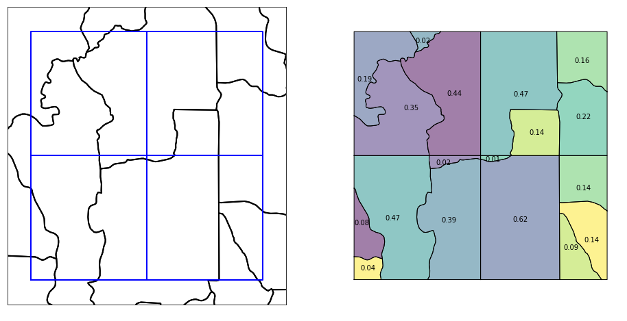
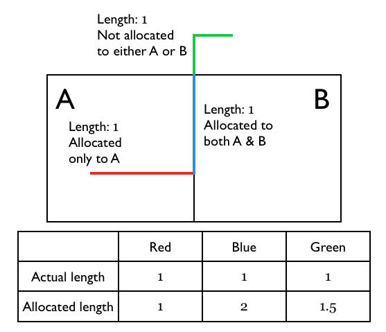
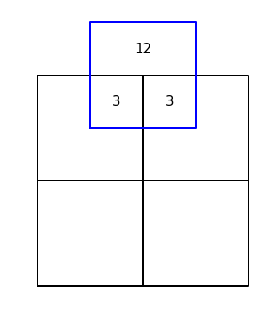
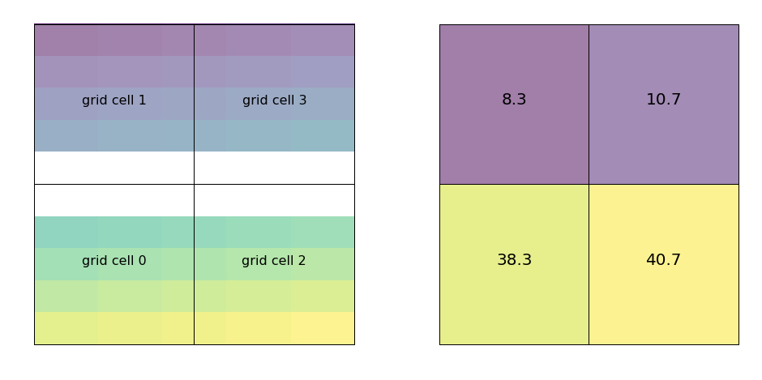

Pandarus
========

Pandarus is a GIS software toolkit for regionalized life cycle assessment. It is designed to work with `brightway LCA framework <https://brightwaylca.org>`__, `brightway2-regional <https://bitbucket.org/cmutel/brightway2-regional>`__, and `Constructive Geometries <https://bitbucket.org/cmutel/constructive-geometries>`__. A separate library, `pandarus-remote <https://github.com/cmutel/pandarus_remote>`__, provides a web API to run Pandarus on a server.

.. contents::

Usage example
-------------

In addition to this documentation, there is also a Jupyter notebook `usage example <https://github.com/cmutel/pandarus/blob/master/docs/usage_example.ipynb>`__.

Intersecting two vector datasets
================================

The main capability of the Pandarus library is to efficiently and correctly intersect the set of spatial features from one vector dataset with the spatial features from another vector dataset. In regionalized life cycle assessment, the first dataset would be inventory locations (polygons, lines, or points), and the second dataset would be regions with site-dependent characterization factors.

.. autofunction:: pandarus.intersect
    :noindex:

Calculating areas
-----------------

Because Pandarus was designed for global data sets, the `Mollweide projection <http://en.wikipedia.org/wiki/Mollweide_projection>`_ is used as the default equal-area projection for calculating areas (in square meters). Although no projection is perfect, the Mollweide has been found to be a reasonable compromise [1]_.

.. [1] Usery, E.L., and Seong, J.C., (2000) `A comparison of equal-area map projections for regional and global raster data <http://cegis.usgs.gov/projection/pdf/nmdrs.usery.prn.pdf>`_

Projections through the calculation chain
-----------------------------------------

The function ``intersect`` calls ``intersection_dispatcher``, which in turns calls ``intersection_worker``, which itself calls ``get_intersection``.

In both ``intersect`` and ``intersection_dispatcher``, spatial units from both the first and second datasets are unprojected. Inside the function ``intersection_worker``, spatial units from the first dataset are projected to WGS 84. ``get_intersection`` calls ``Map.iter_latlong`` on the second dataset, which returns spatial units projected in WGS 84. Area and linear calculations are done on the intersection of spatial units from both the first and second spatial datasets, and are projected to the Mollweide CRS. This projection is done at the time of areal or length calculations.

Lines and points that intersect two vector features
---------------------------------------------------

When calculating the lengths of lines (or number of points) remaining outside a intersected areas, we have the problem that lines can lie along the edge of two vector features, and hence the section of the line would be counted twice. If therefore need to adjust our formula for calculating the lengths (or number of points) outside an intersected area. The key insight is that we don't want the *actual* remaining area, but the right *relative* remaining area - these value are all normalized to one anyway.

The formula for allocating lengths is therefore:

.. math::

    ( total\_actual\_length - total\_intersected\_length ) \cdot \frac{\sum individual\_intersected\_lengths}{total\_intersected\_length}

In the example above, the formula would give the answer 1.5:

.. math::

    1.5 = ( 3 - 2 ) \cdot \frac{2 + 1}{2}

The same procedure is followed for multipoints (geometries that have more than one point), except that instead of calculating lengths you just count the number of points.

Calculating area outside of intersections
-----------------------------------------

For many regionalized methodologies, it is important to know how much area/length from one spatial dataset lies outside a second spatial dataset entirely. The function ``calculate_remaining`` calculates these remaining areas.

.. autofunction:: pandarus.calculate_remaining
    :noindex:

Using intersections spatial dataset as a new spatial scale
----------------------------------------------------------

.. autofunction:: pandarus.intersections_from_intersection
    :noindex:

Calculating raster statistics against a vector dataset
======================================================

Pandarus can calculate mask a raster with each feature from a vector dataset, and calculate the min, max, and average values from the intersected raster cells. This functionality is provided by a patched version of `rasterstats <https://github.com/perrygeo/python-rasterstats>`__.

The vector and raster file should have the same coordinate reference system. No automatic projection is done by this function.

.. autofunction:: pandarus.raster_statistics
    :noindex:

Manipulating raster files
=========================

Pandarus provides some utility functions to help manage and manipulate raster files. Raster files are often provided with incorrect or missing metadata, and the main pandarus capabilities only work on vector files. Unfortunately, however, many raster files require manual fixes outside of these functions.

.. autofunction:: pandarus.clean_raster
    :noindex:

.. autofunction:: pandarus.round_raster
    :noindex:

.. autofunction:: pandarus.convert_to_vector
    :noindex:

FAQ
===

Why the name Pandarus?
----------------------

The software matches two different maps against each other, and `Pandarus was a bit of a matchmaker himself <http://en.wikipedia.org/wiki/Pandarus>`_. Plus, ancient names are 200% more science-y.

Installation
============

Pandarus can be installed directly from `PyPi <https://pypi.python.org/pypi>`_ using `pip` or `easy_install`, e.g.

.. code-block:: bash

    pip install pandarus

However, it is easy to run into errors if geospatial libraries like fiona, rasterio, and shapely are compiled against different versions of GDAL. One way to get an installation that is almost guaranteed is to use `Conda <https://conda.io/miniconda.html>`__:

.. code-block:: bash

    conda config --add channels conda-forge cmutel
    conda create -n pandarus python=3.5
    source activate pandarus
    conda install pandarus

Pandarus source code is on `GitHub <https://github.com/cmutel/pandarus>`__.

Requirements
------------

Pandarus uses the following libraries:

    * `appdirs <https://pypi.python.org/pypi/appdirs>`__
    * `fiona <http://toblerity.org/fiona/index.html>`__
    * `pyproj <https://code.google.com/p/pyproj/>`__
    * `Rtree <http://toblerity.org/rtree/>`__
    * `rasterio <https://github.com/mapbox/rasterio>`__
    * `rasterstats <https://pypi.python.org/pypi/rasterstats>`__
    * `shapely <https://pypi.python.org/pypi/Shapely>`__

Technical Reference
===================

.. toctree::
   :maxdepth: 2

   technical
